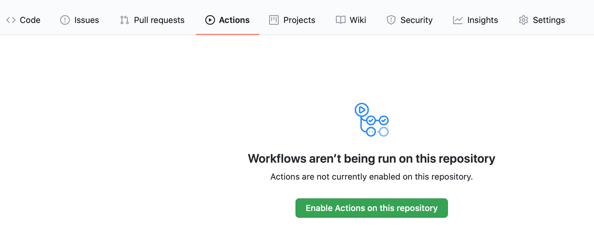

# Github Archiver Template

A template to create a self-scraping archiver using Github Actions. Based entirely on [@simonw](https://github.com/simonw)'s [clever idea](https://simonwillison.net/2020/Oct/9/git-scraping/).

# To use

1. Click the green "Use this template" button to create a new repository in your account ([detailed instructions](https://docs.github.com/en/free-pro-team@latest/github/creating-cloning-and-archiving-repositories/creating-a-repository-from-a-template#creating-a-repository-from-a-template)).

  
See example screenshot

  

2. Select the "Actions" tab then click the green "Enable Actions on this repository" button:

  
See example screenshot

  

3. Edit [this line](.github/workflows/scrape.yml#L17) to include the correct URL that you want to archive. Maybe also change the output file from 'results.csv' if you want something else. You can also do things like pretty print the output here if JSON, as the inspiration project did.

_Optional:_

4. To change the default daily 12pm UTC schedule, edit [this line](.github/workflows/scrape.yml#L7), using [cron notation](https://docs.github.com/en/free-pro-team@latest/actions/reference/events-that-trigger-workflows#scheduled-events). If you edit in Github, it will helpfully interpret the cron notation on hover. Some examples:
    - Every 10 minutes: '*/10 * * * *'
    - Every hour on the hour: '0 * * * *'
    - Once a week on Friday at 4pm UTC: '0 16 * * 5'
    
The file download will also be triggered by a push, or can be run manually in [Actions](../../actions?query=workflow%3A%22Scrape+latest+data%22)
